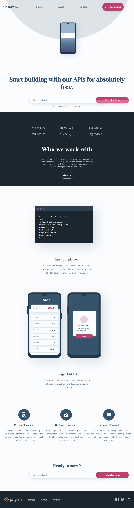

# Frontend Mentor - PayAPI multi-page website solution

This is a solution to the [PayAPI multi-page website challenge on Frontend Mentor](https://www.frontendmentor.io/challenges/payapi-multipage-website-FDLR1Y11e). Frontend Mentor challenges help you improve your coding skills by building realistic projects. 

## Table of contents

- [Overview](#overview)
  - [The challenge](#the-challenge)
  - [Screenshot](#screenshot)
  - [Links](#links)
- [My process](#my-process)
  - [Built with](#built-with)
  - [What I learned](#what-i-learned)
  - [Continued development](#continued-development)

## Overview

### The challenge

Users should be able to:

- View the optimal layout for each page depending on their device's screen size
- See hover states for all interactive elements throughout the site
- Receive an error message when the contact form is submitted if:
  - The `Name`, `Email Address` or `Message` fields are empty should show "This field can't be empty"
  - The `Email Address` is not formatted correctly should show "Please use a valid email address"

### Screenshot



### Links

- Live Site URL: [Add live site URL here](https://sleepy-kepler-f4840a.netlify.app/index.html)

## My process

### Built with

- Semantic HTML5 markup
- CSS custom properties
- Flexbox
- CSS Grid
- Mobile-first workflow
- [Javascript](https://javascript.org/) - JS 


### What I learned

Use this section to recap over some of your major learnings while working through this project. Writing these out and providing code samples of areas you want to highlight is a great way to reinforce your own knowledge.

To see how you can add code snippets, see below:

```js
const validarMail = (e) => {
    switch (e.target.name) {
        case "email1":
            if (expresiones.mail.test(e.target.value)) {
                $mensajeError1.style.display = "none"
                $input.classList.remove("inputsFormInvalido")
                campo.mail = true
            } else {
                $input.classList.add("inputsFormInvalido")
                $mensajeError1.style.display = "block"
                campo.mail = false
            }
            break;
        default:
            console.log("ce mamo")
            break;
    }
    
}

const expresiones = {
    company: /^[a-zA-Z0-9\_\-]{3,16}$/, // Letras, numeros, guion y guion_bajo
    nombre: /^[a-zA-ZÀ-ÿ\s]{3,40}$/, // Letras y espacios, pueden llevar acentos.
    textarea: /^.{4,255}$/, // 4 a 255 digitos.
    mail: /^[a-zA-Z0-9_.+-]+@[a-zA-Z0-9-]+\.[a-zA-Z0-9-.]+$/
}

```
### Continued development

En mis proximos proyectos me gustaria enfocarme mas en diseños mas interactivos con mas animaciones tambien
